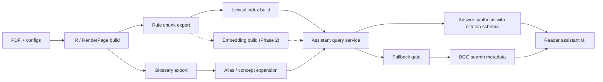

# Rules Assistant Architecture

## Goal

Add a bilingual Aeon Trespass rules assistant that:

- answers in English or Russian
- handles rules questions and gameplay situations
- grounds every answer in the extracted rulebooks first
- returns exact verification links to the relevant pages
- falls back to BoardGameGeek only when the rulebooks do not answer the question

This design must fit the current repo shape:

- IR-first pipeline is the source of truth
- static React reader remains the reading surface
- search/index artifacts are built offline
- runtime operations stay small and boring

## Executive recommendation

Do not make Sphinx the center of this feature.

Use a **rulebook-first retrieval service** built from pipeline-generated rule chunks, with:

- lexical retrieval over normalized chunk text and glossary terms
- a read-only SQLite FTS5 index as the default v1 retrieval engine
- strict answer synthesis that can only cite retrieved rulebook evidence
- exact deep links back into the reader
- a separate, lower-trust BGG fallback path

For your corpus size, around 3-4 books, this is the best fit:

- more trustworthy than page-level keyword search because citations resolve to chunk anchors
- much less operational weight than a dedicated Sphinx deployment or vector database
- safer than a loose "RAG over PDFs" design because the corpus is already structured
- fully aligned with the repo's existing `RenderPageV1` and search artifacts

## Why not Sphinx as the primary architecture

Sphinx is a capable search server, and its current releases include vector index support. But that is not the real constraint here. The hard problem is not "search a lot of text"; it is "answer rules questions from a small, structured, bilingual corpus with exact page citations and no hallucinated authority."

For this repo, Sphinx is the wrong center of gravity because:

- it adds a separate search daemon and configuration surface
- it duplicates logic the pipeline should already own: chunking, metadata, provenance, bilingual alignment
- it optimizes for scale you do not have
- it still leaves answer grounding, citation generation, and fallback policy unsolved

Sphinx is reasonable only as a later swap-in retrieval backend if the corpus grows far beyond Aeon Trespass or query traffic becomes significant. It should not define the v1 architecture.

## Recommended architecture

### 1. Build-time rule corpus in the pipeline

Add a new pipeline export that turns the existing page-level artifacts into assistant-ready rule chunks.

The canonical chunk source should be `PageIRV1`, not `RenderPageV1`.

Use `PageIRV1` because it retains:

- untouched block boundaries
- `section_hint`
- block `bbox`
- `source_ref`
- inline `TermMarkInline` annotations with `concept_id` and `surface_form`

Use `RenderPageV1` only as a downstream publication surface for:

- reader routes
- visible text as exported to the web bundle
- deep-link materialization
- chunk highlighting in the reader

Each chunk should be anchored to the canonical IR, not to an ad hoc scraped text layer.

Suggested schema shape:

- `rule_chunk_id`
- `document_id`
- `edition`
- `page_id`
- `source_page_number`
- `section_path`
- `block_ids`
- `canonical_anchor_id`
- `language`
- `text`
- `normalized_text`
- `glossary_concepts`
- `symbol_ids`
- `deep_link`
- `facsimile_bbox_refs` when available

Chunking rules:

- chunk by semantic unit, not fixed token windows
- prefer paragraph, list item, callout, table row, caption, or short section ranges
- keep chunks small enough to cite precisely
- preserve English and Russian as separate text payloads tied to the same `canonical_anchor_id`
- do not use raw `block_id` alone as the public citation target; one answerable chunk may span multiple blocks
- allow one semantic chunk to reference multiple adjacent blocks when the rule text is split by layout
- allow cross-page chunks only when the source rule is explicitly continuous across a page boundary; otherwise keep chunks page-local and let retrieval merge adjacent hits
- carry `facsimile_bbox_refs` for facsimile-mode pages so citation highlighting can reuse the existing overlay system rather than invent a second highlight model

Concept harvesting rules:

- derive `glossary_concepts` from `TermMarkInline` annotations in `PageIRV1` first
- preserve `surface_form` where it is present so answers can show the exact matched term when useful
- use secondary enrichment only for cases where the current IR lacks inline term marks, not as the primary concept-detection path

### 1.1 Chunk anchor contract

`canonical_anchor_id` needs a deterministic mapping from IR structure, not an ad hoc numbering pass.

Required invariants:

- every chunk is derived from an ordered set of source `block_id` values from `PageIRV1`
- one chunk may cover one block or a short contiguous sequence of blocks
- chunks are page-local by default
- cross-page chunks are allowed only for explicit continuations and must record both participating page ids
- the public citation target is `canonical_anchor_id`, while `block_ids` remain diagnostic/provenance fields

Recommended stability rule:

- derive chunk boundaries from block type plus adjacency rules over `PageIRV1.reading_order`
- derive `canonical_anchor_id` from stable structural inputs, not just "third chunk on page"
- for v1, require deterministic anchor generation from the current IR only; do not promise long-term anchor preservation across major re-extraction changes yet
- if anchor compatibility becomes important after initial rollout, add a later migration layer explicitly rather than baking fuzzy preservation rules into v1

This is the hardest contract in the assistant design. It should be treated as a first-class schema and test concern, not an implementation detail.

This gives you bilingual retrieval without losing traceability.

### 2. Retrieval design: FTS5 first, embeddings later

Use a small query service that combines:

- lexical retrieval over normalized text, section titles, glossary aliases, symbol names, and keywords
- RU/EN query normalization and glossary-driven expansion before retrieval
- lightweight reranking based on source type, section specificity, glossary hits, and citation density

For this corpus size, the simplest good design is:

- build a read-only `assistant_index.sqlite`
- store chunks and retrieval metadata alongside it in JSON or SQLite tables
- use SQLite FTS5 as the primary engine in v1
- add embeddings later only if paraphrase recall is measurably insufficient

This keeps v1 low-ops while still handling most real questions through good chunking, alias expansion, and concept-aware lexical search.

### 2.1 Russian retrieval quality

SQLite FTS5 is the right default, but Russian recall should not rely on the default tokenizer alone.

Recommended v1 approach:

- use FTS5 for indexed retrieval and ranking
- materialize normalized query and chunk fields in the pipeline
- store lemma-like or stemmed variants for RU terms alongside the surface text
- expand queries through glossary aliases and known bilingual concept names before hitting FTS

The exact implementation can vary, but the invariant is simple: `assistant_index.sqlite` must index more than raw surface forms, otherwise inflected Russian queries will miss obvious matches.

Embeddings remain a valid phase-2 addition for:

- weak paraphrase recall
- reranking borderline candidates
- mixed-language query recovery when lexical matching is too brittle

Examples that may justify phase-2 embeddings:

- "Can I do X before Y?"
- "What happens if the Titan moves during..."
- "Когда именно сбрасывается это состояние?"

### 3. Minimal runtime service

Keep the reader static. Add one small runtime component for question answering.

Recommended shape:

- new `apps/assistant/` FastAPI service, or equivalent lightweight Python app
- reads exported assistant artifacts from the pipeline output
- exposes a narrow API such as:
  - `POST /v1/answers`
  - `GET /v1/documents/:documentId/citations/:anchorId`
  - `GET /v1/fallback/bgg/search`

This service owns:

- query normalization
- language detection
- retrieval and ranking
- confidence thresholds
- answer generation
- fallback gating
- response schema validation

Do not put model calls or BGG API calls in the browser.

## Deployment topology and degraded mode

The reader stays a static site. The assistant is an optional live dependency layered on top of it.

Recommended topology:

- static reader hosted as it is today
- separate `apps/assistant/` service with its own deploy unit
- assistant service reads exported assistant artifacts produced by the pipeline
- LLM provider keys live only in the assistant service environment, never in the browser

Graceful degradation is required:

- if the assistant service is unavailable, the reader still loads and reads normally
- the assistant panel should render an unavailable state rather than breaking page navigation
- citation links should remain usable even when synthesis is down
- if answer synthesis is disabled or failing, the service should still be able to return retrieval-only evidence cards in phase 1

This avoids conflating "reader availability" with "assistant availability."

## Answer generation policy

The assistant should not behave like a generic chatbot. It should behave like a constrained rules explainer.

Recommended answer contract:

- `answer_language`
- `answer_summary`
- `applies_when`
- `step_by_step_resolution`
- `ambiguities`
- `citations[]`
- `confidence`
- `fallback_used`

Rules:

- no answer without at least one rulebook citation unless fallback mode is explicitly active
- every major claim should map to one or more retrieved chunks
- if evidence is weak or conflicting, say so plainly
- if the question is underspecified, ask a clarifying question before answering
- answer in the user's language, but keep citations tied to the source edition and page

The model prompt should explicitly forbid:

- inventing rules not present in evidence
- citing pages not present in the retrieved set
- treating BGG discussion as official rules

### Provider and runtime constraints

Phase 1 does not require an LLM. Phase 2 does.

The assistant service should keep the synthesis provider behind a small interface so the rest of the system does not depend on one vendor-specific SDK.

For phase 2, define up front:

- default provider and model for synthesis
- latency target for interactive answers
- per-answer cost target
- timeout and retry policy
- environment-variable based key management in the assistant service only

The current design references OpenAI embeddings only as a plausible phase-2 retrieval enhancement. It does not require OpenAI for synthesis, although using the same provider for embeddings and synthesis is operationally simpler.

## Exact verification links

The current reader already exposes source page numbers in `RenderPageV1`. That is enough for page-level verification today, but for the assistant you should add stable chunk-level citation anchors.

Recommended additions:

- extend render/source-map contracts with stable `canonical_anchor_id`
- add chunk-level anchors to the reader route
- support URLs like:
  - `/documents/ato_core_v1_1/en/p0042#anchor=rule.chunk.0042.03`
  - `/documents/ato_core_v1_1/ru/p0042#anchor=rule.chunk.0042.03`

Reader behavior:

- scroll to the cited chunk
- highlight the relevant text range or facsimile box
- show printed source page number prominently

Implementation note:

- the `#anchor=...` fragment is client-side only, so the reader must parse it in the browser and perform scroll/highlight behavior after the page payload loads

This is the single most important UX requirement for trust.

## Bilingual behavior

Do not maintain separate EN and RU knowledge bases that drift apart.

Instead:

- keep one canonical anchor space
- attach EN and RU text variants to the same semantic chunk when both exist
- expand retrieval using glossary aliases across both languages
- answer in the requested language
- cite either EN pages, RU pages, or both, depending on user preference and edition availability

Recommended query flow:

1. detect or accept requested answer language
2. normalize the query
3. expand it with glossary concepts and known aliases in both languages
4. retrieve across both EN and RU chunk sets
5. deduplicate by canonical anchor
6. synthesize the answer in the target language

This gives the best recall for questions where players mix English rule terms with Russian descriptions.

## BGG fallback

This must be a separate path, not just a lower-ranked retriever.

Recommended rule:

- if rulebook evidence clears threshold, do not touch BGG
- if rulebook evidence does not clear threshold, return either:
  - a clarifying question, or
  - a BGG fallback result set

### Important constraint

BGG's current API guidance requires registration and server-side requests, and their XML API terms explicitly prohibit using XML API data to train an AI or LLM system. Because of that, I do **not** recommend a v1 design that ingests BGG forum content into the model for summarization.

Safe fallback design:

- use server-side BGG requests only
- cache thread metadata and search results conservatively
- return thread links, titles, authors, and timestamps as community references
- label them as non-authoritative community discussion
- include required BGG attribution and token handling

If you want the assistant to read and summarize BGG posts itself, get a policy/legal review first. That should be treated as a separate decision gate.

## Service hardening

The assistant API is user-facing and should be treated as an untrusted-input boundary.

Minimum v1 protections:

- request size limits
- basic rate limiting
- structured logging with sensitive-field redaction
- prompt templates that clearly separate user query, retrieved evidence, and system instructions
- response validation against `assistant_answer_v1`
- strict rule that retrieved forum content, if ever used beyond link metadata, is treated as untrusted text and never elevated to authoritative status

## Data flow

## Relationship to existing search

The current `SearchDocsV1` build is page-level plain-text search generated from render pages, but it is not currently exported into the web bundle and there is no shipped reader search UI today.

That means phase 1 is the first real search-and-discovery feature exposed to users.

The assistant path differs from `search_docs.v1` in both granularity and trust model:

- `search_docs.v1` is a coarse page-level artifact produced in pipeline artifacts today
- assistant retrieval uses chunk-level, citation-aware artifacts built specifically for grounded answering
- phase 1 should be positioned as "assistant evidence explorer with exact citations," not as a thin wrapper over page-level search

If a separate reader search UI is added later, it can continue to use page-level search artifacts or share normalized data with the assistant path, but the assistant should not be designed around page-level search constraints.

`RenderPageV1.search` should not be repurposed as the assistant retrieval contract. It is too underspecified and too tightly coupled to page payloads. The preferred direction is either:

- leave it as a lightweight page-level reader hint field, or
- deprecate it in a later schema revision once assistant-specific contracts are established

Assistant retrieval should live in dedicated assistant schemas and index artifacts.

## Suggested contracts

Add new schemas rather than overloading `search_docs.v1`.

Recommended new contracts:

- `rule_chunk_v1.py`
- `assistant_pack_v1.py`
- `assistant_answer_v1.py`
- `assistant_citation_v1.py`
- `forum_fallback_v1.py`

Possible `AssistantCitationV1` fields:

- `document_id`
- `edition`
- `page_id`
- `source_page_number`
- `canonical_anchor_id`
- `deep_link`
- `quote_snippet`
- `relevance_reason`

Keep `quote_snippet` short and sourced from the rulebook artifact, not regenerated text.

## Schema and codegen flow

This repo's contract direction is mandatory:

- Python Pydantic in `packages/schemas/python/`
- generated JSON Schema in `packages/schemas/jsonschema/`
- generated TypeScript in `packages/schemas/ts/src/generated/`

The assistant schemas must follow the same path. That means any addition such as `assistant_answer_v1.py` or `assistant_citation_v1.py` must be wired into `scripts/generate_jsonschema.py`, `scripts/generate_ts_types.mjs`, and validated through `make codegen` before the reader consumes it.

## Why this is better than classic "RAG over PDFs"

Classic RAG assumes the PDF is just text to chunk. Your repo already disproves that assumption.

Aeon Trespass rules contain:

- inline icons
- callouts
- tables
- terminology constraints
- bilingual editions
- page-faithful verification requirements

The better pattern here is:

- pipeline produces canonical structured evidence
- assistant retrieves from that structured evidence
- model only explains and organizes retrieved evidence

That is not generic RAG. It is **grounded answer synthesis over typed rule artifacts**.

## Recommended implementation phases

### Phase 1

- export `rule_chunk` artifacts from `PageIRV1`
- add canonical citation anchors
- ship FTS5-backed lexical retrieval only
- return cited excerpts and deep links without model synthesis

This proves trust and linkability first. The value is not generic keyword search; it is assistant-grade evidence packaging, chunk-level citations, and one-click verification jumps that the current page-level search artifact does not provide.

Phase 1 should have a concrete consumer:

- either a minimal reader-side evidence explorer or search box that shows cited chunk hits and deep links, or
- an explicitly internal operator/developer endpoint used to validate retrieval quality before the reader UI lands

Do not leave phase 1 as an unowned backend with no declared user.

### Phase 2

- add embeddings if phase-1 recall is insufficient
- add hybrid retrieval and reranking where it materially improves results
- add answer synthesis in EN and RU
- add confidence and ambiguity handling

This is the real assistant.

### Phase 3

- add reader-side assistant panel
- add citation highlighting
- add user controls for answer language and preferred edition

### Phase 4

- add BGG fallback search metadata
- add attribution and policy guardrails
- optionally add operator review for fallback quality

## Concrete repo impact

### Pipeline

- new assistant export stage
- new SQLite FTS5 index build step
- new retrieval/index manifest

### Schemas

- new rule chunk, answer, citation, and fallback schemas
- small render/source-map extension for stable anchors

### Reader

- assistant UI and citation cards
- deep-link scroll/highlight behavior
- visible separation of rulebook citations vs community fallback

### Config

- assistant thresholds
- included documents/books
- default citation edition behavior
- BGG fallback enablement
- language normalization and glossary-expansion settings

All assistant configuration should stay in TOML, consistent with the rest of the repo.

## Rebuild and export flow

Assistant artifacts should be rebuilt as part of the normal export path, not as an ad hoc side process.

Recommended behavior:

- pipeline stages emit `RuleChunkV1`, `AssistantPackV1`, and `assistant_index.sqlite`
- `make export` publishes the assistant artifacts alongside the reader-facing document bundle
- CI should verify assistant artifact generation for fixtures the same way it verifies other export contracts

Implementation note:

- do not continue growing `scripts/export_to_web.py` to absorb assistant indexing and manifest work
- add a separate assistant export/index module or script so the existing export script stays under the repository's file-length gate and keeps a focused responsibility boundary

If build time becomes an issue later, assistant index generation can become a separate target. But v1 is simpler and safer if it rides the existing export flow.

## Test strategy

This repo already treats correctness as a release concern. The assistant needs the same posture.

Minimum test coverage:

- schema round-trip and codegen freshness tests for new assistant schemas
- unit tests for chunk boundary construction and canonical-anchor generation
- retrieval golden-set tests for EN and RU queries
- citation-resolution tests that confirm each emitted citation resolves to a reader route and anchor
- degraded-mode tests where the reader behaves correctly if the assistant service is unavailable
- prompt/response contract tests that reject uncited answers in rulebook mode
- fallback-gating tests that confirm BGG is only queried when rulebook retrieval abstains

## Final recommendation

Build this as a **rulebook-first FTS5-backed retrieval system with a minimal Python answer service**, not as Sphinx-centric search and not as loose PDF RAG.

The decisive design choices are:

- pipeline-generated semantic rule chunks
- one canonical anchor space across EN and RU
- SQLite FTS5 as the default v1 retrieval engine
- strict citation schema with exact reader deep links
- answer generation only from retrieved rulebook evidence
- BGG as a clearly separated fallback path, not part of the main answer corpus

That gives you the best accuracy, the best explainability, and the cleanest fit with the architecture you already have.

## External references

- Sphinx search engine overview: [sphinxsearch.com](https://sphinxsearch.com/)
- SQLite FTS5: [sqlite.org/fts5](https://www.sqlite.org/fts5.html)
- OpenAI embeddings model docs: [text-embedding-3-large](https://developers.openai.com/api/docs/models/text-embedding-3-large)
- BoardGameGeek XML API2: [BGG XML API2](https://boardgamegeek.com/wiki/page/BGG_XML_API2)
- BoardGameGeek API usage guide: [Using the XML API](https://boardgamegeek.com/using_the_xml_api)
- BoardGameGeek XML API terms: [XML API Terms of Use](https://boardgamegeek.com/wiki/page/XML_API_Terms_of_Use)
